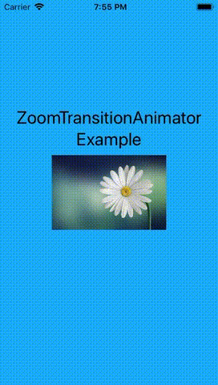

# ZoomTransitionAnimator

[](https://travis-ci.org/yesleon/ZoomTransitionAnimator)
[](http://cocoapods.org/pods/ZoomTransitionAnimator)
[](http://cocoapods.org/pods/ZoomTransitionAnimator)
[](http://cocoapods.org/pods/ZoomTransitionAnimator)

ZoomTransitionAnimator is a transition animator between view controllers. It zooms the whole scene together, not just the cell or image view you selected. Multi-layer zooming (zoom-in from view controller A to B and then to C) is supported. Although not an interactive transition animator, you can use it with `UIPanGestureRecognizer`. As long as you return the correct frame of the target view in absolute space (`UIScreen.main.coordinateSpace`), the animator will find it and zoom out from there.



## Example

To run the example project, clone the repo, and run `pod install` from the Example directory first.

<!--## Requirements-->

## Installation

ZoomTransitionAnimator is available through [CocoaPods](http://cocoapods.org). To install
it, simply add the following line to your Podfile:

```ruby
pod 'ZoomTransitionAnimator'
```

## Usage

1. Initialize and return a `ZoomTransitionAnimator` object in your `UINavigationControllerDelegate` object.

        extension NavigationViewController: UINavigationControllerDelegate {
            func navigationController(_ navigationController: UINavigationController, animationControllerFor operation: UINavigationControllerOperation, from fromVC: UIViewController, to toVC: UIViewController) -> UIViewControllerAnimatedTransitioning? {
                switch (fromVC, toVC) {
                case (let zoomSourceVC as ZoomTransitionSource, let zoomDestinationVC as ZoomTransitionDestination):
                    guard let operation = ZoomTransitionOperation(rawValue: operation.rawValue) else { return nil }
                    return ZoomTransitionAnimator(duration: 0.45, damping: 0.75, source: zoomSourceVC, destination: zoomDestinationVC, operation: operation)
                default:
                    return nil
                }
            }
        }
	
2. Apply both `ZoomTransitionSource` and `ZoomTransitionDestination` protocols to your `ParentViewController`. Or if you only want the zoom animation to appear in only one direction, choose one of them to apply.

        
        extension ParentViewController: ZoomTransitionSource {
            func zoomTransitionAnimator(_ animator: ZoomTransitionAnimator, targetViewBeginningFrameFor operation: ZoomTransitionOperation) -> CGRect {
                switch operation {
                case .zoomIn:
                    return selectedCellImageViewFrame
                case .zoomOut:
                    fatalError()
                }
            }
        }

        extension ParentViewController: ZoomTransitionDestination {
            func zoomTransitionAnimator(_ animator: ZoomTransitionAnimator, targetViewFinalFrameFor operation: ZoomTransitionOperation) -> CGRect
                switch operation {
                case .zoomIn:
                    fatalError()
                case .zoomOut:
                    return selectedCellImageViewFrame
                }
            }
        }
        
Since the `ParentViewController` is not going to be a zoom-in destination, you could put `fatalError()` there. These cases were designed for when a `ViewController` is both zoom-out destination and zoom-in destination. That is, multi-layer zooming.
        
3. Apply those protocols to your `ChildViewController` too.

        extension ChildViewController: ZoomTransitionSource {
            func zoomTransitionAnimator(_ animator: ZoomTransitionAnimator, targetViewBeginningFrameFor operation: ZoomTransitionOperation) -> CGRect {
                switch operation {
                case .zoomIn:
                    fatalError()
                case .zoomOut:
                    return imageViewFrame
                }
            }
        }

        extension ChildViewController: ZoomTransitionDestination {
            func zoomTransitionAnimator(_ animator: ZoomTransitionAnimator, targetViewFinalFrameFor operation: ZoomTransitionOperation) -> CGRect
                switch operation {
                case .zoomIn:
                    return imageViewFrame
                case .zoomOut:
                    fatalError()
                }
            }
        }
        
And that's it, really. You don't have to return any `UIView`, just the frame of it. So if you want to zoom out from the content of a `UIScrollView`, just calculate the frame with `scrollView.contentOffset` and `scrollView.contentSize`. No need to make a snapshot view anymore.

## Author

yesleon, yesleon@me.com

## License

ZoomTransitionAnimator is available under the MIT license. See the LICENSE file for more info.
